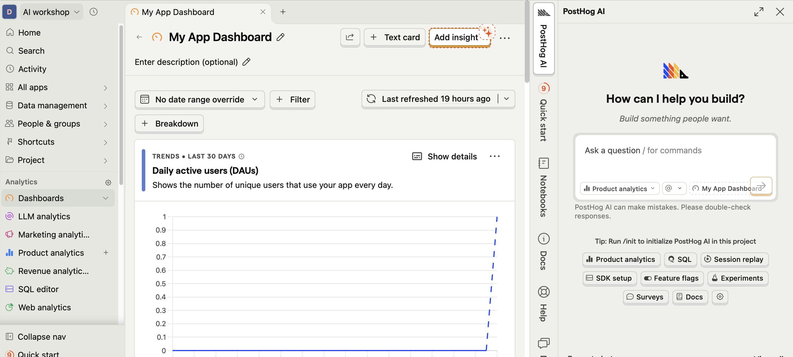

You've built something amazing and put it online. But how do you know if people are actually using it? That's where analytics come in!

## What is PostHog?

PostHog is a free, open-source analytics tool that helps you understand:
- How many people visit your site
- What pages they view
- What buttons they click
- Where they come from
- And much more!

It's privacy-friendly and has a generous free tier - perfect for personal projects.

## Why Analytics Matter

Without analytics, you're flying blind:

```
┌────────────────────────────────────────────────────────────┐
│                                                            │
│   Without Analytics:                                       │
│   "I wonder if anyone uses my site?" 🤷                    │
│                                                            │
│   With Analytics:                                          │
│   "50 people visited yesterday! Most clicked the          │
│    contact button but few filled out the form.            │
│    I should make the form simpler."  💡                   │
│                                                            │
└────────────────────────────────────────────────────────────┘
```

## Step 1: Create a PostHog Account

1. Go to [posthog.com](https://posthog.com)
2. Click **"Get Started - Free"**
3. Sign up with your email or GitHub account

### During Setup

- Choose **"PostHog Cloud"** (easiest option)
- Select your region (usually US or EU)
- Name your project

<div class="checkpoint">
  <div class="checkpoint-title">✅ Checkpoint</div>
  <p>You should now see your PostHog dashboard!</p>
</div>

## Step 2: Get Your Snippet

PostHog will give you a JavaScript snippet to add to your site.

1. Once you've created a new Project, use the onboarding wizard
2. Look for the technology you are using in your project in the search bar or just copy the API key and ask Claude to implement posthog for you

## Step 3: Add to Your Website

Paste the snippet in your HTML file, just before the closing `</head>` tag:

```html
<!DOCTYPE html>
<html lang="en">
<head>
  <meta charset="UTF-8">
  <title>My Awesome Project</title>
  <link rel="stylesheet" href="styles.css">

  <!-- PostHog Analytics -->
  <script>
    !function(t,e){/* ... PostHog snippet ... */}
    posthog.init('YOUR_API_KEY_HERE', {api_host: 'https://app.posthog.com'})
  </script>
</head>
<body>
  <!-- Your content -->
</body>
</html>
```

<div class="warning-box">
  <strong>⚠️ Replace the API key!</strong> Make sure to use your actual PostHog API key from your dashboard.
</div>

## Step 4: Test It's Working

1. Save your file
2. Open it in your browser
3. Go back to PostHog dashboard
4. Click **"Live Events"** in the sidebar
5. You should see your visit appear in real-time!

<div class="checkpoint">
  <div class="checkpoint-title">✅ Checkpoint</div>
  <p>If you see events appearing in PostHog, analytics is working!</p>
</div>

## Step 5: Track Custom Events

PostHog automatically tracks page views. But you can also track specific actions like button clicks and form submissions! Posthog also comes with session replays out of the box which means that you can also view your users using your website in a anonymized manner.

## Understanding Your Dashboard

Let's explore what PostHog shows you:



### Web Analytics

The main dashboard shows:
- **Unique visitors** - How many different people visited
- **Page views** - Total pages viewed
- **Sessions** - Browsing sessions
- **Bounce rate** - People who left immediately

## Creating Your First Insight

Insights help you answer specific questions about your data. 

##### Asking Posthog's AI
Now with Posthog's inbuilt AI, you can just talk to the AI and get it to implement the insights you want. Once it creates the insight in chat, remember to 'Save' it so that you can add it to the Dashboard.
##### Manually setting up Insights
To explore making your own insights, here's an example on how you could go about it.

1. Go to **"Insights"** in PostHog
2. Click **"New Insight"**
3. Choose **"Trends"**
4. Select your event (e.g., "signup_button_clicked")
5. Click **"Save"**

Now you can see how many times that button was clicked over time! Play around with the configurations like Filters, Breakdowns and Visualization types and see what works best for you.

## What to Track (And What Not To)

### Good Things to Track

| Event | Why It's Useful |
|-------|-----------------|
| Page views | Know which pages are popular |
| Button clicks | See what features people use |
| Form submissions | Track conversions |
| Error occurrences | Find problems to fix |
### Don't Track

- Personal information (names, emails)
- Passwords or sensitive data
- Anything users wouldn't expect

## PostHog Free Tier

PostHog's free tier includes:
- **1 million events/month** - Plenty for personal projects
- **Session recordings**
- **Feature flags**
- **Unlimited team members**

Perfect for what we're building!


<div class="checkpoint">
  <div class="checkpoint-title">✅ Checkpoint</div>
  <p>That's it! You've added analytics to your project! You can now see how people interact with your site.</p>
</div>

## What You've Accomplished!

Take a moment to appreciate how far you've come:

- ✅ Created a GitHub account
- ✅ Installed Claude Code
- ✅ Learned Git basics
- ✅ Built a real project with AI
- ✅ Tested it locally
- ✅ Deployed it to the internet
- ✅ Learned to use the Claude API
- ✅ Added analytics

**You're no longer a complete beginner - you're a builder!** 🎉


## Next Steps

Check out the Reference section for:
- [Cheat Sheet](/ai-workshop/reference/cheat-sheet/) - Quick command reference
- [Glossary](/ai-workshop/reference/glossary/) - Terms explained
- [Troubleshooting](/ai-workshop/troubleshooting/) - Common issues and fixes
[[]]