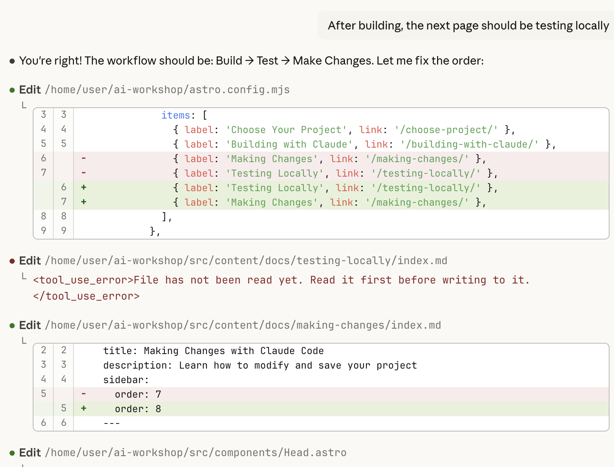

This is the moment you've been waiting for! Let's use Claude Code to build your project.

### Step 1: Open a new Claude Code chat

1. Choose the repository you want Claude to work on. Eg., username/username.github.io
2. Select the default Cloud environment
3. Paste your prompt
4. (optional) Add any images for design reference

### Step 2: Watch and Learn

Claude Code will:

1. **Plan** - Think about the best approach
2. **Create files** - Generate HTML, CSS, and JavaScript files
3. **Explain** - Tell you what it's doing and why

  <strong>⚠️ Be patient!</strong> Complex projects might take a minute or two. Don't interrupt Claude Code while it's working.

### Step 3: Review What Was Created

After Claude Code finishes, let's see what files were created. Claude code would have created a new branch and pushed it's work to that branch. You will need to *fetch* those changes to your local system for review.

  <strong>💡 Want more tips?</strong> Check out <a href="/ai-workshop/claude-tips/">Working with Claude Code: Tips & Tricks</a> in the Level Up section for advanced techniques!

## Troubleshooting

### Github Repo not installed

You will need to re-connect the Github Integration and Select the repository you are working on.

## Next Steps

Now that you have the code in your local system, you need to know how to verify it! In the next section, we'll learn how to test your sites locally.

  
✅ Checkpoint

  
Claude Code has created your project files. Ready to Test them?

