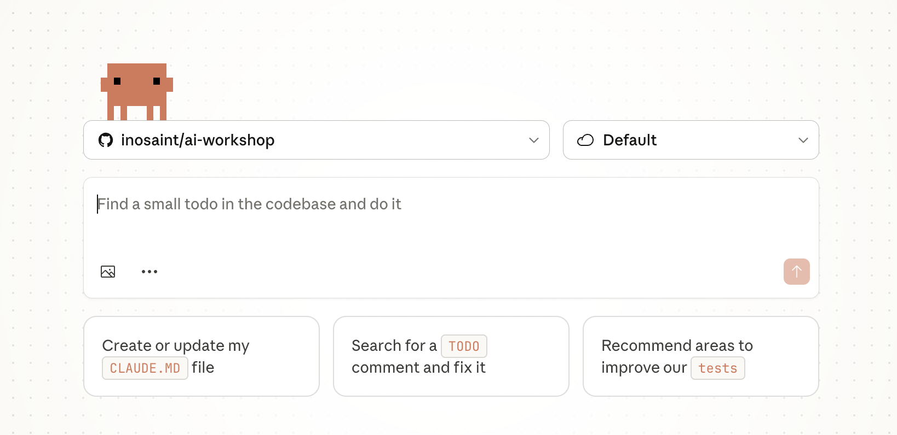
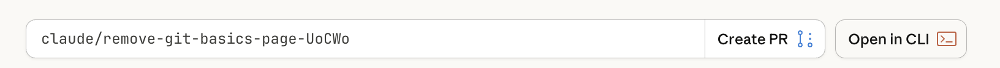
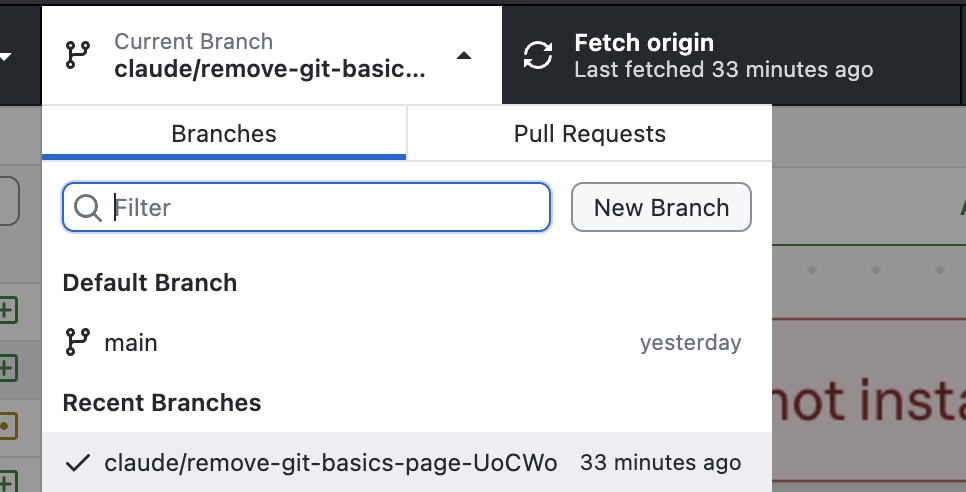
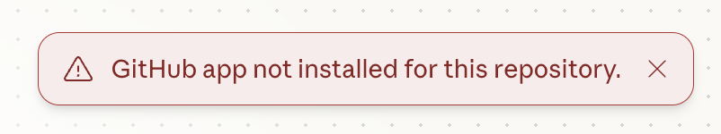

# Building with Claude Code

This is the moment you've been waiting for! Let's use Claude Code to build your project.

### Step 1: Open a new Claude Code chat



1. Choose the repository you want Claude to work on. Eg., username/username.github.io
2. Select the default Cloud environment
3. Paste your prompt
4. (optional) Add any images for design reference


### Step 2: Watch and Learn

Claude Code will:

1. **Plan** - Think about the best approach
2. **Create files** - Generate HTML, CSS, and JavaScript files
3. **Explain** - Tell you what it's doing and why

<div class="warning-box">
  <strong>⚠️ Be patient!</strong> Complex projects might take a minute or two. Don't interrupt Claude Code while it's working.
</div>


### Step 3: Review What Was Created



After Claude Code finishes, let's see what files were created. Claude code would have created a new branch and pushed it's work to that branch. You will need to *fetch* those changes to your local system for review.

## Accessing Claude's Changes with Github Desktop


### Step 1: Open GitHub Desktop

Switch to GitHub Desktop. You should see the above bar at the top. The left-most section is the repository you are on. The middle section is the branch you are on and the rightmost section is the 'actionable' section.

### Step 2: Navigate to your branch



Use the branch selector to select the branch that Claude worked on. 

### Pulling from Origin

After you select the correct branch, you may see a button to "Pull Origin". Do that.

## Example Conversation

Here's what a typical session might look like:

```
You: Create a simple landing page with a hero section,
     3 feature cards, and a footer with social links

Claude: I'll create a clean landing page for you. Let me
        set up the structure with HTML, add styling with
        CSS, and include some interactive elements...

        [Creates index.html]
        [Creates styles.css]
        [Creates script.js]

        Done! I've created a landing page with:
        - A hero section with a headline and CTA button
        - 3 feature cards with icons
        - A footer with social media links

        You can open index.html in your browser to see it.

You: Can you make the feature cards have a hover effect?

Claude: Sure! I'll add a smooth hover animation to the
        cards...

        [Updates styles.css]

        Done! Now when you hover over a card, it will
        lift up slightly with a shadow effect.
```

<div class="tip-box">
  <strong>💡 Want more tips?</strong> Check out <a href="/ai-workshop/claude-tips/">Working with Claude Code: Tips & Tricks</a> in the Level Up section for advanced techniques!
</div>


## Troubleshooting

### Github Repo not installed



You will need to re-connect the Github Integration and Select the repository you are working on.

### Files weren't created

Make sure you're in the right folder. Run `pwd` (Mac) or `cd` (Windows) to see your current location.

## Next Steps

You have a working project created by Claude Code! In the next section, we'll learn how to make changes and save your progress with GitHub.

<div class="checkpoint">
  <div class="checkpoint-title">✅ Checkpoint</div>
  <p>Claude Code has created your project files. Ready to make changes!</p>
</div>
