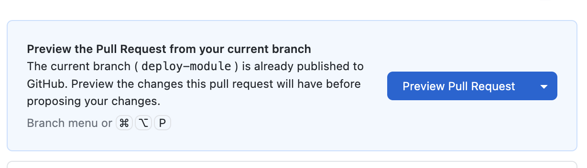

This is the moment of truth! Let's put your project on the internet where anyone can see it.
### Step 1: Verify Your Code is on GitHub

Let's make sure everything is ready:

1. Open **GitHub Desktop**
2. Click on '**Fetch Origin**'
3. Check that the **Changes tab** is empty (all changes committed)

If everything is in order, then you are ready to merge your changes to the main codebase.

### Step 2: Create a Pull Request

Now let's move your local code to the main branch.


1. Open **GitHub Desktop**
2. There should be a button to '**Preview Pull Request**'
3. Click on that and it will take you to Github.com.
4. Fill in the description of the Pull Request and then click on '**Create Pull Request**'
5. Github will run some checks and when they complete, you can click on the final '**Merge Branch**' and complete the merger. 

<div class="tip-box">
  If you encounter any errors here, paste those errors in Claude so that you can debug them.
</div>

### Step 3: Visit Your Live Site!

GitHub usually needs a minute or two to build and deploy your site. Type it in your browser:

```
https://YOUR-USERNAME.github.io/YOUR-REPO-NAME/
```

🎉 **Congratulations! Your project is live on the internet!**

## Updating Your Site

Now after seeing the site live on the internet, you may need to make changes. 

It's recommended to start a new chat in Claude code for every new change as Claude tends to create a new branch to work in. Incase you create a branch on **Github Desktop**, Claude Code will not be able to access it. 

To make changes you can repeat the steps mentioned in 'Making Changes'.

## Troubleshooting

#### Deployment delays


This is an optional step incase you need to debug. 

1. **Check Actions tab** - See if the deployment is still running
2. Check if there are any errors pointed out. 

### 404 Error / Page Not Found

- **Check the URL** - Make sure you're using the correct repository name
- **Check your files** - Make sure you have an `index.html` file in the root of your repository
- **Wait a bit** - First deployment can take up to 10 minutes

### Blank Page

- **Check browser console** for errors (F12 → Console tab)
- **Check file paths** - Links to CSS/JS might need updating
- **Case sensitivity** - `Styles.css` is different from `styles.css`

### Changes Not Showing

- **Wait 2-5 minutes** - GitHub Pages caches aggressively
- **Hard refresh** - `Ctrl + Shift + R` (Windows) or `Cmd + Shift + R` (Mac)
- **Check Actions tab** - See if the deployment is still running


<div class="tip-box">
  <strong>💡 Pro Tip:</strong> You can use a custom domain (like "yourname.com") instead of the github.io address. That's a bit more advanced, but GitHub has <a href="https://docs.github.com/en/pages/configuring-a-custom-domain-for-your-github-pages-site" target="_blank">great documentation</a> if you're interested!
</div>


<div class="checkpoint">
  <div class="checkpoint-title">✅ Checkpoint</div>
  <p>Your project is LIVE on the internet! You just deployed a real website. 🎉</p>
</div>

## What's Next?

You've accomplished something amazing - going from zero to a deployed website!

Take a moment to appreciate how far you've come:

- ✅ Created a GitHub account
- ✅ Installed Claude Code
- ✅ Learned Git basics
- ✅ Built a real project with AI
- ✅ Tested it locally
- ✅ Deployed it to the internet

In the next sections, we'll level up your skills by:
- Learning to use the Claude API directly
- Adding analytics to track visitors
