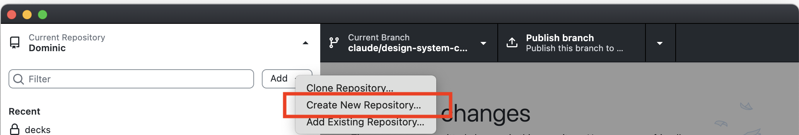
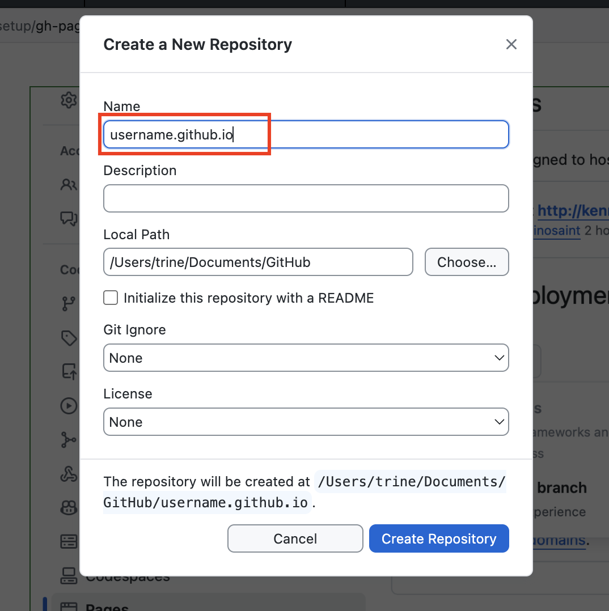
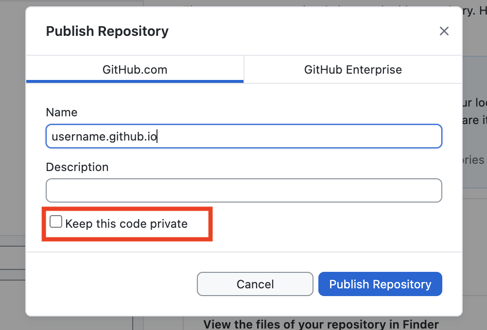
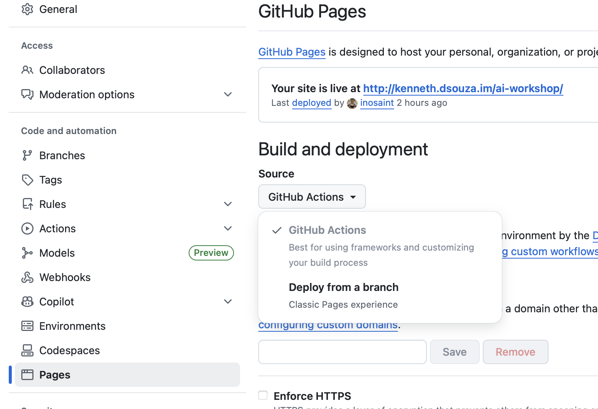

  अगर आप पहले से GitHub से परिचित हैं और आपके पास अकाउंट है, तो आप इस अनुभाग को छोड़ सकते हैं।

GitHub वह जगह है जहाँ डेवलपर्स अपना कोड स्टोर करते हैं। इसे **कोड के लिए Google Drive** समझें।

इस अनुभाग में, आप एक मुफ़्त GitHub अकाउंट बनाएंगे जिसका उपयोग आप बाकी वर्कशॉप में करेंगे।

### Git क्या है?

**Git आपके कोड के लिए एक टाइम मशीन है।**

याद है जब आप फ़ाइलें इस तरह सेव करते थे:
- `design_final.psd`
- `poster_final_v2.ai`
- `design_FINAL_FINAL.sketch`
- `design_FINAL_FINAL_actually_final.fig`

Git इस समस्या को बड़े सुंदर तरीके से हल करता है। कॉपियाँ बनाने की बजाय, Git आपके हर बदलाव को ट्रैक करता है। आप:
- किसी भी पुराने वर्शन पर वापस जा सकते हैं
- देख सकते हैं क्या बदला और कब
- एक-दूसरे का काम ओवरराइट किए बिना दूसरों के साथ काम कर सकते हैं

## Git बनाम GitHub: क्या अंतर है?

| Git                          | GitHub                          |
| ---------------------------- | ------------------------------- |
| आपके कंप्यूटर पर सॉफ्टवेयर | इंटरनेट पर वेबसाइट             |
| स्थानीय रूप से बदलाव ट्रैक करता है | आपका कोड क्लाउड में स्टोर करता है |
| मुफ़्त और ओपन सोर्स         | सार्वजनिक प्रोजेक्ट के लिए मुफ़्त |
| ऑफलाइन काम करता है          | इंटरनेट की आवश्यकता होती है    |

## शब्दों का संक्षिप्त परिचय

आगे बढ़ने से पहले, आइए कुछ ऐसे शब्दों को समझें जिनसे आपको परिचित होना होगा।

| अवधारणा | रोज़मर्रा की उपमा |
|---|---|
|**GitHub**|Google Drive (क्लाउड) की तरह, लेकिन विशेष रूप से कोड प्रोजेक्ट के लिए बनाया गया|
|**Repository** (repo)|एक फ़ोल्डर जिसमें आपकी प्रोजेक्ट फ़ाइलें होती हैं|
|**Commit**|अपने काम का एक वर्शन सेव करना (नोट के साथ "Save As" की तरह)|
|**Push**|अपना सेव किया हुआ काम क्लाउड पर अपलोड करना|
|**Pull**|क्लाउड से नवीनतम वर्शन डाउनलोड करना|

अभी इन्हें याद करने की ज़रूरत नहीं है - जब हम इनका उपयोग करेंगे तो ये अपने आप समझ आ जाएंगे!

## अपना GitHub अकाउंट सेट करना

### चरण 1:

**[github.com](https://github.com/)** पर जाएं और अपना अकाउंट बनाएं। अकाउंट बनाते समय एक अच्छा username चुनें। आपका username ही Github pages के लिए डिफ़ॉल्ट नाम के रूप में उपयोग होगा, इसलिए कुछ professional चुनें (मेरे जैसा नहीं)।

### चरण 2:

[Github Desktop](https://desktop.github.com) डाउनलोड करें और अपनी नई बनाई गई credentials से लॉगिन करें।

### चरण 3:

Github Desktop का उपयोग करके [एक नई repository बनाएं](https://docs.github.com/en/desktop/overview/creating-your-first-repository-using-github-desktop#creating-a-new-repository) (repo)।

इसे निम्नलिखित प्रारूप में नाम दें: [username].github.io, जहाँ *username* आपका github username है। यही आपके मुफ़्त github डोमेन के रूप में उपयोग होगा। कृपया कोई गलती न करें, repository का नाम अपने github username की वर्तनी और अक्षरों (बड़े/छोटे) के हिसाब से बिल्कुल एक जैसा होना चाहिए।

Github Desktop और इसके इंटरफ़ेस के बारे में अधिक जानने के लिए आप [Github के सहायता लेख](https://docs.github.com/en/desktop/overview/creating-your-first-repository-using-github-desktop) पर जा सकते हैं।

### चरण 4:

Repo को publish करें। Publish करते समय, कृपया 'Keep this code private' चेकबॉक्स को अनचेक करना याद रखें।

### चरण 5:

Github.com पर जाएं और अपनी नई बनाई गई repository पर जाकर Settings पर क्लिक करें।

### चरण 6:

बाईं nav में pages पर जाएं और '**Deploy from a Branch**' चुनें, फिर **main / root** चुनें और '**Save**' पर क्लिक करें।

अगर आपने repository publish करते समय 'Keep this code private' चेकबॉक्स को अनचेक नहीं किया था, तो आपको अतिरिक्त चरणों का पालन करना होगा। आपको Setting > General में जाना होगा और फिर पेज को नीचे तक स्क्रॉल करके 'Danger Zone' में 'Change repository visibility' को Private से Public में बदलना होगा।

## अगले चरण

आपका GitHub अकाउंट तैयार है। अगले अनुभाग में, हम आपके कंप्यूटर पर Claude Code इंस्टॉल करेंगे।

  <strong>💡 सुझाव:</strong> GitHub का टैब खुला रखें - हम जल्द ही इस पर वापस आएंगे!

