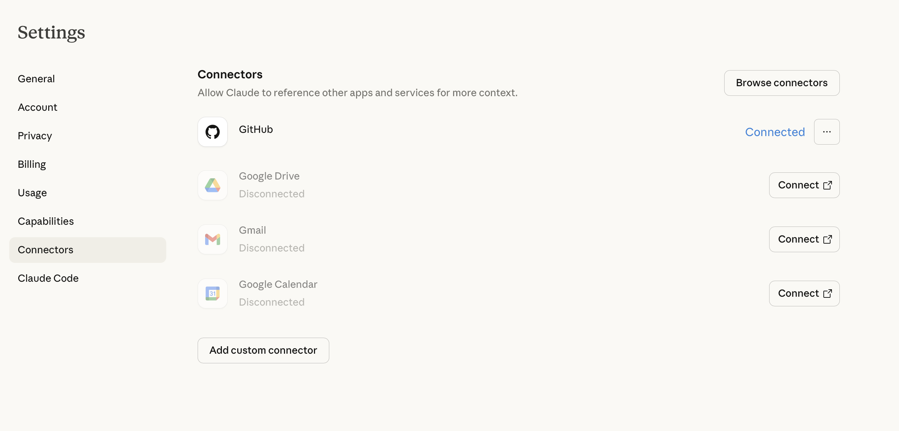
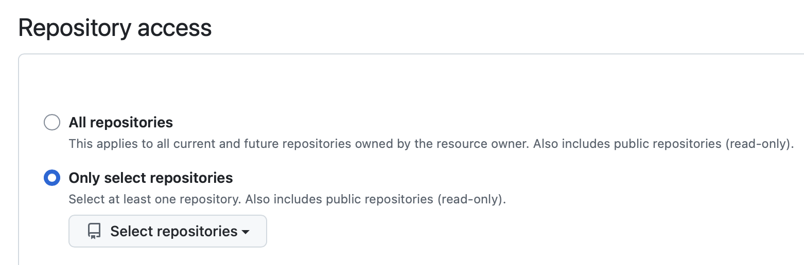

अगला कदम - आइए अपने कंप्यूटर पर Claude Code इंस्टॉल करें। हम Claude Code डेस्कटॉप ऐप का उपयोग करेंगे, जिसमें बिल्डिंग शुरू करने के लिए आपको जो कुछ भी चाहिए वह सब शामिल है।

## Claude Code डाउनलोड करें

### Windows/Mac

1. **[claude.ai/download](https://claude.ai/download)** पर जाएं (या Claude Code के आधिकारिक डाउनलोड पेज पर)
2. **"Download for Windows/Mac"** पर क्लिक करें
3. इंस्टॉलर डाउनलोड हो जाएगा (आमतौर पर आपके Downloads फ़ोल्डर में)

## Claude Code इंस्टॉल करें

### Windows

1. अपने Downloads फ़ोल्डर से डाउनलोड की गई फ़ाइल खोलें
2. इंस्टॉलेशन विज़ार्ड का पालन करें
3. **"Install"** पर क्लिक करें और इंस्टॉलेशन पूरी होने तक प्रतीक्षा करें
4. पूरा होने पर **"Finish"** पर क्लिक करें

### Mac

1. अपने Downloads फ़ोल्डर से डाउनलोड की गई `.dmg` फ़ाइल खोलें
2. **Claude Code** ऐप को अपने **Applications** फ़ोल्डर में खींचें
3. **Applications** खोलें और **Claude Code** पर डबल-क्लिक करें
4. यदि आपको सुरक्षा चेतावनी दिखाई दे, तो पुष्टि करने के लिए **"Open"** पर क्लिक करें

  
✅ चेकपॉइंट

  
Claude Code अब आपके कंप्यूटर पर इंस्टॉल हो गया है!

### Github को Claude Code से कनेक्ट करें

शुरू करने से पहले, हमें Claude Code को Github से कनेक्ट करना होगा। आपको Claude की सेटिंग्स में जाना होगा और Github को कनेक्ट करना होगा।

आपको अपने Github लॉगिन को प्रमाणित करना होगा और फिर आपको **Integrations > Applications > Claude** पेज पर ले जाया जाएगा। यहाँ आप सभी रिपॉजिटरी तक पहुँच देने या केवल उस रिपॉजिटरी को चुनने का विकल्प चुन सकते हैं जिस पर आप इस समय काम कर रहे हैं।

यदि आप '**Select repository**' चुनते हैं, तो आप वह रिपॉजिटरी चुन सकते हैं जो आपने अभी बनाई है।

## समस्या निवारण

 Github Integration के बारे में अधिक जानकारी आप <a href="https://support.claude.com/en/articles/10167454-using-the-github-integration"> Claude की सहायता साइट<a> पर पा सकते हैं।

### इंस्टॉलेशन के बाद Claude Code नहीं मिल रहा (Mac)
अपना **Applications** फ़ोल्डर जाँचें। यदि Claude Code वहाँ है लेकिन नहीं खुल रहा, तो उस पर राइट-क्लिक करें और सुरक्षा चेतावनी को बायपास करने के लिए **"Open"** चुनें।

### इंस्टॉलेशन अटकी हुई है या पूरी नहीं हो रही (Windows)

इंस्टॉलर को Administrator के रूप में चलाने का प्रयास करें:
1. इंस्टॉलर फ़ाइल पर राइट-क्लिक करें
2. **"Run as administrator"** चुनें
3. इंस्टॉलेशन के चरणों का फिर से पालन करें

### "App is damaged" संदेश (Mac)

यह डाउनलोड किए गए ऐप्स के साथ हो सकता है। यह प्रयास करें:
1. **Terminal** खोलें
2. यह चलाएं: `xattr -cr /Applications/Claude\ Code.app`
3. Claude Code को फिर से खोलने का प्रयास करें

### "npm is not recognized" (Windows)

Command Prompt को पूरी तरह बंद करें और फिर से खोलें। इंस्टॉलेशन के लिए एक नई विंडो की आवश्यकता होती है।

## अगले कदम

Claude Code इंस्टॉल हो गया है और Github सेटअप हो गया है, इसलिए अब आप शुरू करने के लिए तैयार हैं! अगला, आप Claude Code के साथ बनाने के लिए एक प्रोजेक्ट चुनेंगे।