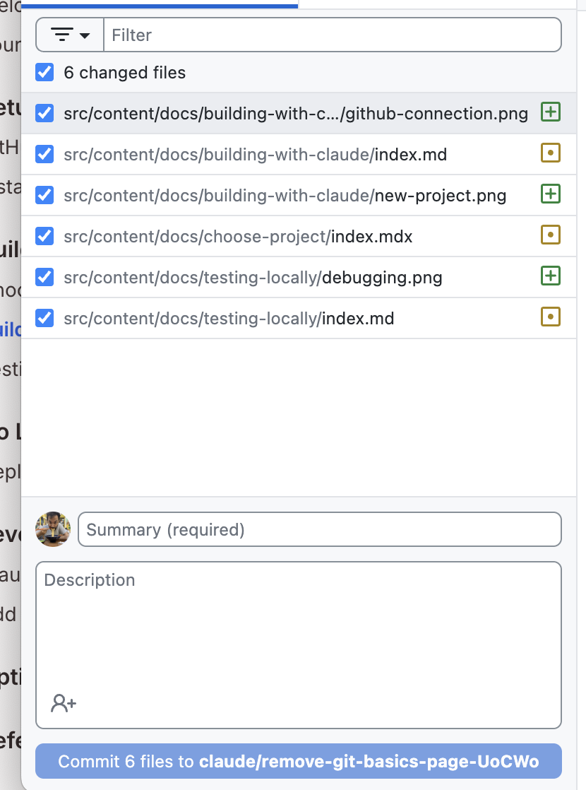

Sekarang setelah Claude Code membuat proyek Anda dan Anda bisa melihatnya di sistem Anda, Anda akan ingin membuat perubahan dan perbaikan. Begini caranya!

## Membuat Perubahan

Ingin mengubah sesuatu? Anda memiliki dua pilihan:

## Metode 1: Tanya Claude Code (Direkomendasikan)

Cara termudah — cukup katakan kepada Claude Code apa yang harus diubah atau bagikan screenshot atau gambar desain (hanya gambar PNG, GIF, WebP, JPEG yang didukung, tidak ada PDF)

```text
Change the heading font to something more playful
```

```text
Make the buttons bigger and add rounded corners
```

```text
Add a footer with copyright information
```

## Metode 2: Edit File Sendiri

Anda juga bisa mengedit file langsung menggunakan editor teks apa pun:

1. Buka file di editor teks (VS Code, Notepad++, TextEdit, dll.)
2. Buat perubahan Anda
3. Simpan file
4. Refresh browser untuk melihat perubahan

<div class="tip-box">
  <strong>💡 Tips Pro:</strong> Coba buat perubahan kecil sendiri! Jika ada yang rusak, Anda selalu bisa meminta Claude Code untuk memperbaikinya.
</div>

### Simpan Kemajuan Anda dengan GitHub Desktop

Setelah membuat perubahan pada proyek Anda, mari simpan dengan GitHub Desktop:

#### Langkah 1: Buka GitHub Desktop

1. Beralih ke GitHub Desktop.
2. Klik '**Fetch Origin**' jika Anda ingin mengambil perubahan yang dilakukan Claude Code dan verifikasi secara lokal.
3. Jika Anda telah membuat perubahan manual di editor, Anda seharusnya melihat file baru Anda terdaftar di tab "Changes".

<div class="tip-box">
  Jika Anda meminta Claude membuat perubahan untuk Anda, Anda bisa melewati Langkah 2 dan 3 yang tertulis di bawah.
</div>

#### Langkah 2: Tinjau Perubahan Anda

Klik pada file untuk melihat apa yang dibuat atau dimodifikasi. Semua file yang berubah seharusnya sudah dicentang.



#### Langkah 3: Commit Perubahan Anda

1. Di kolom "Summary" di kiri bawah, ketik sesuatu yang mendeskripsikan perubahan yang Anda buat
   - Pertama kali: `Initial project created with Claude Code`
   - Setelah perubahan: `Updated button styles and added footer`
1. Klik tombol **"Commit to branch"**

<div class="checkpoint">
  <div class="checkpoint-title">✅ Pos Pemeriksaan</div>
  <p>Anda tahu cara membuat perubahan dan menyimpan kemajuan. Siap untuk meletakkannya di internet?</p>
</div>

## Praktik Terbaik

### 1. Commit Sering
Simpan pekerjaan Anda secara berkala dengan pesan commit yang bermakna. Ini menciptakan riwayat yang bisa Anda rujuk kembali.

### 2. Uji Sebelum Commit
Selalu lihat perubahan Anda di browser sebelum commit untuk memastikan semuanya berfungsi seperti yang diharapkan.

### 3. Tulis Pesan Commit yang Jelas
Daripada "updates" atau "changes", tuliskan:
- "Add contact form with validation"
- "Fix navigation menu alignment"
- "Update color scheme to blue"

Anda bahkan bisa meminta Claude untuk membantu menulis ini.

## Langkah Selanjutnya

Di bagian berikutnya, kita akan belajar cara [deploy proyek Anda ke GitHub Pages](/id/deploy-github-pages/) dan membuatnya bisa diakses di internet.
