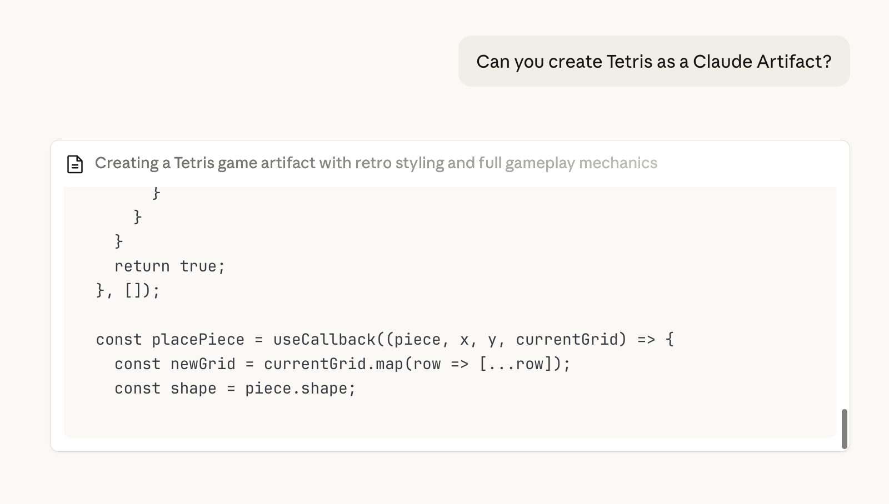

Sebelum kita masuk ke instalasi dan pengaturan, mari rasakan apa yang bisa dilakukan AI **sekarang juga**.

ChatGPT, Grok, dan Claude adalah LLM populer di dunia Barat. Untuk latihan ini, kita akan menggunakan Claude, meski Anda bisa mencoba dengan LLM pilihan Anda.

## Apa itu Claude?

Bayangkan Claude sebagai **asisten super cerdas** yang bisa Anda ajak bicara melalui antarmuka chat dalam bahasa sehari-hari. Saat ini Anda dapat menggunakan Claude dan LLM lainnya untuk berbagai tugas — mulai dari menyunting posting blog hingga menghasilkan gambar bahkan membangun aplikasi lengkap.

Claude memiliki fitur bernama **Artifacts** yang memungkinkan Anda membuat sesuatu secara instan di browser — tanpa perlu pengaturan!

### Langkah 1: Buka Claude

Buka [claude.ai](https://claude.ai/) di browser Anda dan buat akun.

### Langkah 2: Minta Claude Membuat Sesuatu

Setelah masuk, Anda akan melihat antarmuka dengan kolom input. Coba ajukan pertanyaan sederhana kepada Claude untuk membiasakan diri.

Setelah siap, mari buat artefak AI pertama Anda.

Salin dan tempel prompt ini ke Claude:

```
Can you create Tetris as a Claude Artifact?
```

Tekan **Enter** dan saksikan!

Catatan: Anda bebas menggunakan game sederhana lain yang ingin Anda buat, atau lihat [Prompt Tambahan](#prompt-tambahan) di bawah.

### Langkah 3: Saksikan Keajaiban

Dalam hitungan detik, Claude akan membuat **game Tetris yang berfungsi** langsung di browser Anda!



### Langkah 4: Iterasi pada Hasilnya

Apakah hasilnya memuaskan?
Jika tidak, coba minta perubahan.

Contoh: Anda bisa meminta perubahan gaya visual atau menambahkan elemen game baru yang menyenangkan.

✅ Anda baru saja membuat aplikasi pertama Anda dengan AI!
Semua dalam 5 menit. Bayangkan apa yang bisa Anda bangun dengan lebih banyak waktu.

## Prompt Tambahan

Berikut beberapa hal menyenangkan yang bisa Anda minta Claude untuk dibuat:

### Timer Pomodoro

```
Create a Pomodoro timer with 25-minute work sessions and 5-minute breaks.
Add start, pause, and reset buttons. Show the time in a large, easy-to-read format.
```

### Generator Palet Warna

```
Create a color palette generator that shows 5 harmonious colors.
Add a "Generate New Palette" button. Show the hex codes for each color and let me click to copy them.
```

### Game Sederhana

```
Create a simple memory card matching game with 8 pairs of cards. When I click two cards, show if they match. Track my number of moves.
```

## Mengapa Ini Penting

Apa yang baru Anda lakukan adalah inti dari yang akan kita pelajari di workshop ini:

1. **Anda memberi instruksi kepada AI** (sebuah prompt)
2. **AI menciptakan sesuatu yang berguna** (kode yang berfungsi)
3. **Anda langsung menggunakannya** (tanpa pengaturan rumit)

Perbedaannya? **Claude Artifacts** berjalan sementara di browser Anda. Di workshop ini, Anda akan belajar cara:

- Membuat proyek yang **hidup permanen** di internet
- Membangun sesuatu **di komputer Anda sendiri**
- Memiliki **kendali penuh** atas kode Anda
- Berbagi kreasi dengan **siapa saja di dunia**

## Siap untuk Lebih?

Sekarang setelah Anda melihat apa yang mungkin, mari siapkan peralatan yang akan memungkinkan Anda membangun apa pun yang bisa Anda bayangkan.

<div class="tip-box">
  <strong>💡 Jaga tab Claude tetap terbuka!</strong> Anda dapat menggunakan Artifacts untuk membuat prototipe ide dengan cepat sepanjang workshop.
</div>
