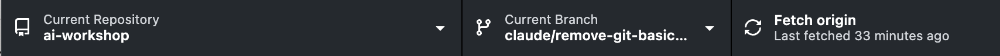
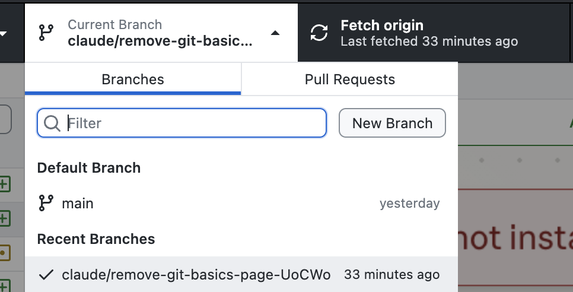
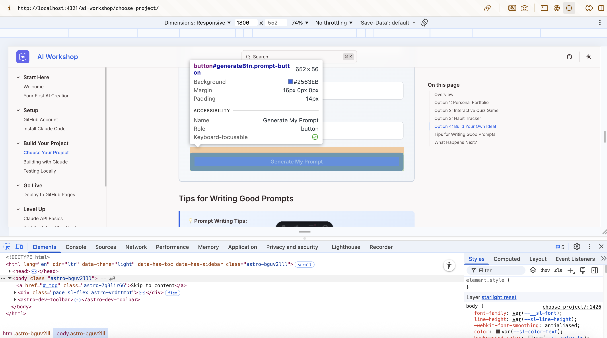

Sebelum berbagi proyek Anda dengan dunia, pastikan proyek berjalan dengan baik di komputer Anda sendiri.

## Apa Artinya "Pengujian Lokal"?

"Lokal" berarti di komputer Anda sendiri (bukan di "cloud" atau "online").

Saat Anda menguji secara lokal:
- Hanya Anda yang bisa melihatnya
- Perubahan muncul secara instan
- Anda bisa merusak sesuatu dengan aman (tidak ada orang lain yang akan melihat!)
- Gratis — tidak perlu hosting

## Mengakses Perubahan Claude dengan Github Desktop


### Langkah 1: Buka GitHub Desktop

Beralih ke GitHub Desktop. Anda akan melihat bar di atas. Bagian paling kiri adalah repository yang sedang Anda gunakan. Bagian tengah adalah branch yang sedang Anda gunakan dan bagian paling kanan adalah bagian 'actionable'.

### Langkah 2: Navigasikan ke branch Anda



Gunakan pemilih branch untuk memilih branch tempat Claude bekerja.

### Menarik dari Origin

Setelah Anda memilih branch yang benar, Anda mungkin melihat tombol "Pull Origin". Lakukan itu. Jika tidak, klik '**Fetch Origin**' dan tunggu aplikasi memeriksa pembaruan.

## Pengujian Lokal

Ada dua metode yang bisa Anda pilih untuk menguji pekerjaan Claude Code.

## Metode 1: Buka Saja File HTML

Jika Anda memilih membangun proyek statis sederhana, cara paling mudah untuk melihat proyek Anda adalah navigasikan ke folder di file finder Anda dan buka file **index.html**

Membuka file ini seharusnya membuka jendela browser baru dan Anda bisa melihat proyek Anda.

<div class="tip-box">
  <strong>💡 Tips:</strong> Address bar akan menampilkan sesuatu seperti <code>file:///path/to/your/file</code>. Ini berarti Anda melihat file lokal, bukan website di internet.
</div>

## Metode 2: Gunakan Server Lokal (Direkomendasikan)

Beberapa fitur (seperti memuat data atau menggunakan JavaScript tertentu) memerlukan server "nyata". Begini cara mengaturnya:

### Langkah 1: Membuka Terminal

**Windows:**
1. Tekan `⊞ Win + R` untuk membuka dialog Run
2. Ketik `cmd` dan tekan Enter
3. Jendela Command Prompt akan terbuka

**Mac:**
1. Tekan `Cmd + Space` untuk membuka Spotlight
2. Ketik `Terminal` dan tekan Enter
3. Jendela Terminal akan terbuka


<div class="tip-box">
  <strong>💡 Referensi Terminal:</strong> Untuk perintah terminal dan tips lainnya, lihat <a href="/id/reference/cheat-sheet/#terminal--command-line">bagian Terminal di Lembar Contekan kami</a>.
</div>

### Langkah 2: Navigasikan ke Proyek Anda

Di terminal, gunakan `cd` (change directory) untuk masuk ke folder proyek Anda. Anda bisa menggunakan menu aksi informasi folder sistem untuk menemukan pathname folder lengkap.

**Windows:**
```bash
cd Documents\GitHub\my-project
```

**Mac:**
```bash
cd ~/Documents/GitHub/my-project
```

<div class="tip-box">
  <strong>💡 Tips:</strong> Ganti "my-project" dengan nama folder proyek Anda yang sebenarnya. Jika Anda tidak yakin di mana GitHub Desktop menyimpan proyek, periksa GitHub Desktop → Preferences → Advanced → Repository storage location.
</div>


Anda bisa memverifikasi bahwa Anda berada di tempat yang benar dengan menjalankan:
- **Windows:** `dir`
- **Mac:** `ls`

Anda seharusnya melihat file proyek Anda (atau folder kosong jika baru saja dibuat).

### Langkah 3: Jalankan server
Setelah Anda navigasi ke folder proyek di terminal, jalankan perintah berikut:

**Python 3:**
```bash
python -m http.server 8000
```

**Python 2 (sistem yang lebih lama):**
```bash
python -m SimpleHTTPServer 8000
```

Ini akan menyiapkan server lokal di port 8000 dan saat berjalan, seharusnya membuka browser Anda secara otomatis ke URL yang benar. Jika tidak, gunakan URL di bawah ini.
```
http://localhost:8000
```

Jika Anda menemui error di jendela terminal, salin dan tempel error tersebut ke chat Claude dan Claude akan memberi tahu apa yang perlu dilakukan.

## Daftar Periksa Pengujian

Periksa proyek Anda dan cek hal-hal berikut:

### Pemeriksaan Visual

- [ ] Apakah semuanya tampil di layar?
- [ ] Apakah warna-warnanya terlihat benar?
- [ ] Apakah teks bisa dibaca (tidak terlalu kecil/besar)?
- [ ] Apakah gambar dimuat dengan benar?

### Pemeriksaan Interaktif

- [ ] Apakah tombol melakukan sesuatu saat diklik?
- [ ] Apakah tautan menuju tempat yang benar?
- [ ] Apakah formulir menerima input?
- [ ] Apakah animasi/efek berfungsi?

### Pemeriksaan Responsif (Ramah Mobile)

Sebagian besar browser memungkinkan Anda mensimulasikan perangkat mobile:

1. Klik kanan di mana saja di halaman
2. Klik **"Inspect"** atau **"Inspect Element"**
3. Klik ikon **device toggle** (terlihat seperti ponsel/tablet)
4. Pilih perangkat berbeda untuk diuji

## Menemukan Masalah? Perbaiki!

Saat ada yang tidak beres, Anda memiliki pilihan:

### Pilihan 1: Tanya Claude Code

Kembali ke Claude Code dan deskripsikan masalahnya:

```text
When I click "Submit", nothing happens. The form should
show a success message.
```

Atau ambil screenshot error dan deskripsikan cara Anda ingin memperbaikinya.

```text
The color contrast of the button on the homepage isn't as per accessibility guidelines. Can you fix it?
```

### Pilihan 2: Debug Sendiri

Buka alat developer browser Anda:

- **Windows**: Tekan `F12` atau `Ctrl + Shift + I`
- **Mac**: Tekan `Cmd + Option + I`

Cari pesan error berwarna merah di tab **Console**. Pesan ini memberi tahu apa yang salah. Jika Anda tidak mengerti artinya, tempel pesan-pesan ini ke chat Claude dan Claude akan membantu menentukan langkah selanjutnya.



## Pemecahan Masalah

### Gambar Tidak Dimuat

**Kemungkinan penyebab:**
- Path file salah (periksa atribut `src`)
- File berada di folder yang salah
- Typo di nama file (huruf besar-kecil berpengaruh!)

**Perbaikan:** Pastikan path gambar Anda cocok persis dengan lokasi file:
```html
<!-- Jika gambar di folder yang sama -->


<!-- Jika gambar di folder "images" -->

```

### CSS Tidak Diterapkan

**Kemungkinan penyebab:**
- File CSS tidak terhubung di HTML
- Typo di path link CSS
- Browser menyimpan versi lama dalam cache

**Perbaikan:** Periksa bagian `<head>` HTML Anda:
```html
<link rel="stylesheet" href="styles.css">
```

Coba hard refresh: `Ctrl + Shift + R` (Windows) atau `Cmd + Shift + R` (Mac)

### JavaScript Tidak Berfungsi

**Kemungkinan penyebab:**
- File script tidak terhubung
- Script dimuat sebelum elemen HTML ada
- Error sintaks dalam kode

**Perbaikan:** Periksa Console untuk error, dan pastikan script Anda ada di bagian bawah body:
```html
<body>
  <!-- Konten Anda -->

  <script src="script.js"></script>  <!-- Letakkan script di akhir! -->
</body>
```


<div class="checkpoint">
  <div class="checkpoint-title">✅ Pos Pemeriksaan</div>
  <p>Proyek Anda berjalan secara lokal dan Anda telah menyimpan kemajuan. Ada perubahan yang ingin Anda buat?</p>
</div>

## Langkah Selanjutnya

Sekarang setelah versi pertama proyek vibe coding Anda berjalan, Anda bisa melanjutkan untuk [membuat perubahan pada proyek Anda](/id/making-changes/) atau langsung ke [deploy di GitHub Pages](/id/deploy-github-pages/).
