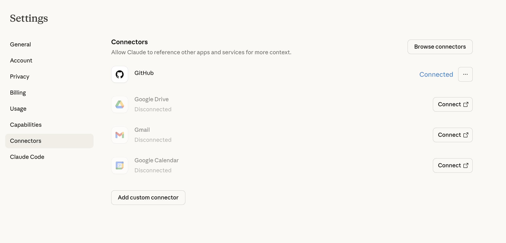
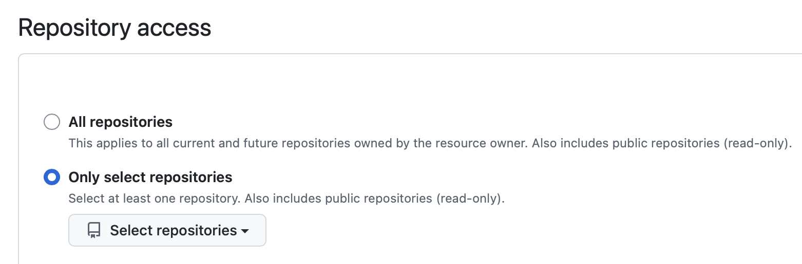

# Installing Claude Code

Next - let's install Claude Code on your computer. We'll be using the Claude Code desktop app, which includes everything you need to start building.

## Download Claude Code

### Windows/Mac

1. Go to **[claude.ai/download](https://claude.ai/download)** (or the official Claude Code download page)
2. Click **"Download for Windows/Mac"**
3. The installer will download (usually to your Downloads folder)

## Install Claude Code

### Windows

1. Open the downloaded file from your Downloads folder
2. Follow the installation wizard
3. Click **"Install"** and wait for the installation to complete
4. Click **"Finish"** when done
### Mac

1. Open the downloaded `.dmg` file from your Downloads folder
2. Drag the **Claude Code** app to your **Applications** folder
3. Open **Applications** and double-click **Claude Code**
4. If you see a security warning, click **"Open"** to confirm

  
✅ Checkpoint

  
Claude Code is now installed on your computer!

## Opening Your Terminal

Before we test Claude Code, you need to know how to open the terminal on your system.

### Windows

1. Press `⊞ Win + R` to open the Run dialog
2. Type `cmd` and press Enter
3. The Command Prompt window will open

### Mac

1. Press `Cmd + Space` to open Spotlight
2. Type `Terminal` and press Enter
3. The Terminal window will open

  <strong>💡 Terminal Reference:</strong> For more terminal commands and tips, check out the <a href="/ai-workshop/reference/cheat-sheet/#terminal--command-line">Terminal section of our Cheat Sheet</a>.

### Connect Github to Claude Code

Before we start, we need to connect Claude code to Github. You need to navigate to Claude's settings and connect Github.

You will need to authenticate your github login and then you should be taken to the **Integrations > Applications >Claude** page. Here you can make a choice to select all repositories access or only the one you are working on at this moment. 

If you choose to '**Select repository**', you can select the one you have just created.

## Troubleshooting

 You can find more information about the Github Integration on <a href="https://support.claude.com/en/articles/10167454-using-the-github-integration"> Claude's help site<a>.

### Can't find Claude Code after installation (Mac)
Check your **Applications** folder. If Claude Code is there but won't open, right-click it and select **"Open"** to bypass the security warning.

### Installation stuck or won't complete (Windows)

Try running the installer as Administrator:
1. Right-click the installer file
2. Select **"Run as administrator"**
3. Follow the installation steps again

### "App is damaged" message (Mac)

This can happen with downloaded apps. Try:
1. Open **Terminal**
2. Run: `xattr -cr /Applications/Claude\ Code.app`
3. Try opening Claude Code again

### “npm is not recognized” (Windows)

Close Command Prompt completely and reopen it. The installation needs a fresh window to work.

## Next Steps

Claude Code is installed and Github has been setup so now you are ready to go! Next, you'll choose a project to build with Claude Code.
