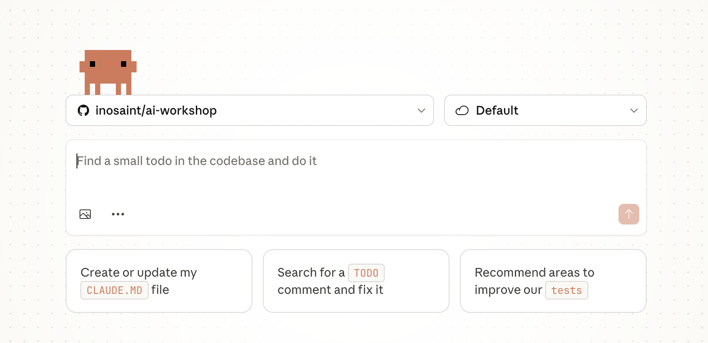
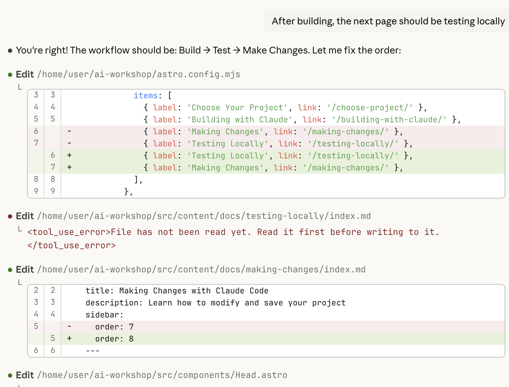
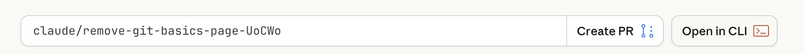
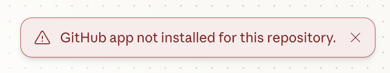

ನೀವು ಕಾಯುತ್ತಿದ್ದ ಕ್ಷಣ ಬಂದಿದೆ! ನಿಮ್ಮ ಪ್ರಾಜೆಕ್ಟ್ ನಿರ್ಮಿಸಲು Claude Code ಅನ್ನು ಬಳಸೋಣ.

### ಹಂತ 1: ಹೊಸ Claude Code ಚಾಟ್ ತೆರೆಯಿರಿ

1. Claude ಕೆಲಸ ಮಾಡಬೇಕಾದ ರೆಪೊಸಿಟರಿಯನ್ನು ಆರಿಸಿ. ಉದಾ., username/username.github.io
2. ಡೀಫಾಲ್ಟ್ Cloud ಪರಿಸರವನ್ನು ಆಯ್ಕೆ ಮಾಡಿ
3. ನಿಮ್ಮ ಪ್ರಾಂಪ್ಟ್ ಅನ್ನು ಅಂಟಿಸಿ
4. (ಐಚ್ಛಿಕ) ವಿನ್ಯಾಸ ಉಲ್ಲೇಖಕ್ಕಾಗಿ ಯಾವುದಾದರೂ ಚಿತ್ರಗಳನ್ನು ಸೇರಿಸಿ

### ಹಂತ 2: ವೀಕ್ಷಿಸಿ ಮತ್ತು ಕಲಿಯಿರಿ

Claude Code ಈ ಕೆಳಗಿನವುಗಳನ್ನು ಮಾಡುತ್ತದೆ:

1. **ಯೋಜಿಸುತ್ತದೆ** - ಅತ್ಯುತ್ತಮ ವಿಧಾನದ ಬಗ್ಗೆ ಯೋಚಿಸುತ್ತದೆ
2. **ಫೈಲ್‌ಗಳನ್ನು ರಚಿಸುತ್ತದೆ** - HTML, CSS, ಮತ್ತು JavaScript ಫೈಲ್‌ಗಳನ್ನು ತಯಾರಿಸುತ್ತದೆ
3. **ವಿವರಿಸುತ್ತದೆ** - ಅದು ಏನು ಮಾಡುತ್ತಿದೆ ಮತ್ತು ಏಕೆ ಎಂದು ತಿಳಿಸುತ್ತದೆ

  <strong>⚠️ ತಾಳ್ಮೆ ತಾಳಿ!</strong> ಸಂಕೀರ್ಣ ಪ್ರಾಜೆಕ್ಟ್‌ಗಳಿಗೆ ಒಂದು ಅಥವಾ ಎರಡು ನಿಮಿಷ ತಗಲಬಹುದು. Claude Code ಕೆಲಸ ಮಾಡುತ್ತಿರುವಾಗ ಅಡ್ಡಿಪಡಿಸಬೇಡಿ.

### ಹಂತ 3: ರಚಿಸಿದ್ದನ್ನು ಪರಿಶೀಲಿಸಿ

Claude Code ಮುಗಿಸಿದ ನಂತರ, ಯಾವ ಫೈಲ್‌ಗಳನ್ನು ರಚಿಸಲಾಗಿದೆ ಎಂದು ನೋಡೋಣ. Claude code ಹೊಸ ಶಾಖೆಯನ್ನು ರಚಿಸಿ ಅದರ ಕೆಲಸವನ್ನು ಆ ಶಾಖೆಗೆ ಪುಶ್ ಮಾಡಿರುತ್ತದೆ. ಪರಿಶೀಲನೆಗಾಗಿ ಆ ಬದಲಾವಣೆಗಳನ್ನು ನಿಮ್ಮ ಸ್ಥಳೀಯ ಸಿಸ್ಟಮ್‌ಗೆ *fetch* ಮಾಡಬೇಕಾಗುತ್ತದೆ.

  <strong>💡 ಹೆಚ್ಚಿನ ಸಲಹೆಗಳು ಬೇಕೇ?</strong> ಸುಧಾರಿತ ತಂತ್ರಗಳಿಗಾಗಿ Level Up ವಿಭಾಗದಲ್ಲಿ <a href="/claude-tips/">Working with Claude Code: Tips & Tricks</a> ಅನ್ನು ಪರಿಶೀಲಿಸಿ!

## ದೋಷನಿವಾರಣೆ

### Github Repo ಸ್ಥಾಪನೆಯಾಗಿಲ್ಲ

ನೀವು Github Integration ಅನ್ನು ಮರು-ಸಂಪರ್ಕಿಸಬೇಕು ಮತ್ತು ನೀವು ಕೆಲಸ ಮಾಡುತ್ತಿರುವ ರೆಪೊಸಿಟರಿಯನ್ನು ಆಯ್ಕೆ ಮಾಡಬೇಕು.

## ಮುಂದಿನ ಹಂತಗಳು

ಕೋಡ್ ನಿಮ್ಮ ಸ್ಥಳೀಯ ಸಿಸ್ಟಮ್‌ನಲ್ಲಿ ಇರುವ ಈಗ, ಅದನ್ನು ಹೇಗೆ ಪರಿಶೀಲಿಸಬೇಕು ಎಂದು ತಿಳಿಯಬೇಕು! ಮುಂದಿನ ವಿಭಾಗದಲ್ಲಿ, [ನಿಮ್ಮ ಪ್ರಾಜೆಕ್ಟ್ ಅನ್ನು ಸ್ಥಳೀಯವಾಗಿ ಪರೀಕ್ಷಿಸುವುದು](/testing-locally/) ಹೇಗೆ ಎಂದು ಕಲಿಯೋಣ.

  
✅ ಚೆಕ್‌ಪಾಯಿಂಟ್

  
Claude Code ನಿಮ್ಮ ಪ್ರಾಜೆಕ್ಟ್ ಫೈಲ್‌ಗಳನ್ನು ರಚಿಸಿದೆ. ಅವುಗಳನ್ನು ಪರೀಕ್ಷಿಸಲು ಸಿದ್ಧರಿದ್ದೀರಾ?

