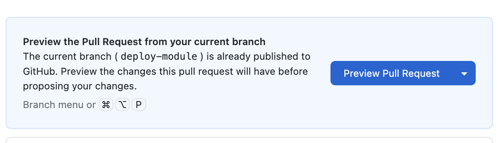
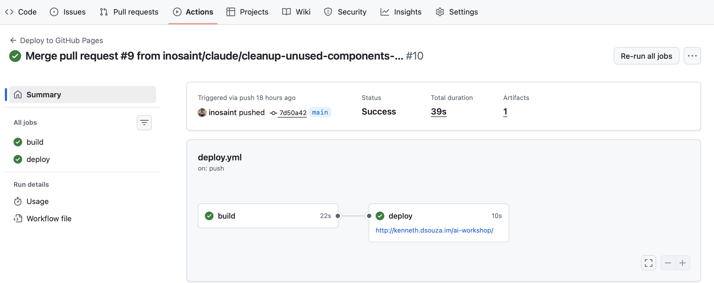

ಇದು ಸತ್ಯದ ಕ್ಷಣ! ನಿಮ್ಮ ಯೋಜನೆಯನ್ನು ಇಂಟರ್ನೆಟ್‌ನಲ್ಲಿ ಹಾಕೋಣ, ಅಲ್ಲಿ ಯಾರಾದರೂ ಅದನ್ನು ನೋಡಬಹುದು.

### ಹಂತ 1: ನಿಮ್ಮ ಕೋಡ್ GitHub ನಲ್ಲಿ ಇದೆಯೇ ಎಂದು ಪರಿಶೀಲಿಸಿ

ಎಲ್ಲವೂ ಸಿದ್ಧವಾಗಿದೆ ಎಂದು ಖಚಿತಪಡಿಸಿಕೊಳ್ಳೋಣ:

1. **GitHub Desktop** ತೆರೆಯಿರಿ
2. '**Fetch Origin**' ಕ್ಲಿಕ್ ಮಾಡಿ
3. **Changes tab** ಖಾಲಿ ಇದೆಯೇ ಎಂದು ಪರಿಶೀಲಿಸಿ (ಎಲ್ಲಾ ಬದಲಾವಣೆಗಳು ಕಮಿಟ್ ಆಗಿವೆ)

ಎಲ್ಲವೂ ಸರಿಯಾಗಿದ್ದರೆ, ನಿಮ್ಮ ಬದಲಾವಣೆಗಳನ್ನು ಮುಖ್ಯ ಕೋಡ್‌ಬೇಸ್‌ಗೆ ಮರ್ಜ್ ಮಾಡಲು ನೀವು ಸಿದ್ಧರಾಗಿದ್ದೀರಿ.

### ಹಂತ 2: Pull Request ರಚಿಸಿ

ಈಗ ನಿಮ್ಮ ಸ್ಥಳೀಯ ಕೋಡ್ ಅನ್ನು ಮುಖ್ಯ ಶಾಖೆಗೆ ಸರಿಸೋಣ.


1. **GitHub Desktop** ತೆರೆಯಿರಿ
2. '**Preview Pull Request**' ಎಂಬ ಬಟನ್ ಇರಬೇಕು
3. ಅದರ ಮೇಲೆ ಕ್ಲಿಕ್ ಮಾಡಿ, ಅದು ನಿಮ್ಮನ್ನು Github.com ಗೆ ಕರೆದೊಯ್ಯುತ್ತದೆ
4. Pull Request ನ ವಿವರಣೆ ತುಂಬಿ, ನಂತರ '**Create Pull Request**' ಕ್ಲಿಕ್ ಮಾಡಿ
5. Github ಕೆಲವು ಪರಿಶೀಲನೆಗಳನ್ನು ನಡೆಸುತ್ತದೆ ಮತ್ತು ಅವು ಪೂರ್ಣಗೊಂಡ ನಂತರ, ನೀವು ಅಂತಿಮ '**Merge Branch**' ಕ್ಲಿಕ್ ಮಾಡಿ ವಿಲೀನವನ್ನು ಪೂರ್ಣಗೊಳಿಸಬಹುದು

<div class="tip-box">
  ನೀವು ಇಲ್ಲಿ ಯಾವುದೇ ದೋಷಗಳನ್ನು ಎದುರಿಸಿದರೆ, ಅವುಗಳನ್ನು ಡೀಬಗ್ ಮಾಡಲು Claude ನಲ್ಲಿ ಆ ದೋಷಗಳನ್ನು ಅಂಟಿಸಿ.
</div>

### ಹಂತ 3: ನಿಮ್ಮ ಲೈವ್ ಸೈಟ್ ಭೇಟಿ ಮಾಡಿ!

GitHub ಸಾಮಾನ್ಯವಾಗಿ ನಿಮ್ಮ ಸೈಟ್ ಅನ್ನು ಬಿಲ್ಡ್ ಮಾಡಿ ನಿಯೋಜಿಸಲು ಒಂದು ಅಥವಾ ಎರಡು ನಿಮಿಷಗಳು ಬೇಕಾಗುತ್ತದೆ. ನಿಮ್ಮ ಬ್ರೌಸರ್‌ನಲ್ಲಿ ಟೈಪ್ ಮಾಡಿ:

```
https://YOUR-USERNAME.github.io/YOUR-REPO-NAME/
```

🎉 **ಅಭಿನಂದನೆಗಳು! ನಿಮ್ಮ ಯೋಜನೆ ಇಂಟರ್ನೆಟ್‌ನಲ್ಲಿ ಲೈವ್ ಆಗಿದೆ!**

## ನಿಮ್ಮ ಸೈಟ್ ಅನ್ನು ನವೀಕರಿಸುವುದು

ಸೈಟ್ ಅನ್ನು ಇಂಟರ್ನೆಟ್‌ನಲ್ಲಿ ಲೈವ್ ಆಗಿ ನೋಡಿದ ನಂತರ, ನೀವು ಬದಲಾವಣೆಗಳನ್ನು ಮಾಡಬೇಕಾಗಬಹುದು.

ಪ್ರತಿ ಹೊಸ ಬದಲಾವಣೆಗೆ Claude code ನಲ್ಲಿ ಹೊಸ ಚಾಟ್ ಪ್ರಾರಂಭಿಸಲು ಶಿಫಾರಸು ಮಾಡಲಾಗಿದೆ, ಏಕೆಂದರೆ Claude ಕೆಲಸ ಮಾಡಲು ಹೊಸ ಶಾಖೆ ರಚಿಸುವ ಪ್ರವೃತ್ತಿ ಇದೆ. **Github Desktop** ನಲ್ಲಿ ನೀವು ಶಾಖೆ ರಚಿಸಿದರೆ, Claude Code ಅದನ್ನು ಪ್ರವೇಶಿಸಲು ಸಾಧ್ಯವಾಗುವುದಿಲ್ಲ.

ಬದಲಾವಣೆಗಳನ್ನು ಮಾಡಲು [Claude Code ನೊಂದಿಗೆ ಬದಲಾವಣೆಗಳನ್ನು ಮಾಡುವುದು](/making-changes/) ನಲ್ಲಿ ತಿಳಿಸಿದ ಹಂತಗಳನ್ನು ಪುನರಾವರ್ತಿಸಬಹುದು.

## ಸಮಸ್ಯೆ ನಿವಾರಣೆ

ಹೆಚ್ಚಿನ ಪರಿಹಾರಗಳಿಗಾಗಿ, ನಮ್ಮ ಪೂರ್ಣ [ಸಮಸ್ಯೆ ನಿವಾರಣೆ ಮಾರ್ಗದರ್ಶಿ](/troubleshooting/) ನೋಡಿ.

#### ನಿಯೋಜನೆ ವಿಳಂಬಗಳು



ನೀವು ಡೀಬಗ್ ಮಾಡಬೇಕಾದರೆ ಇದು ಐಚ್ಛಿಕ ಹಂತವಾಗಿದೆ.

1. **Actions tab ಪರಿಶೀಲಿಸಿ** - ನಿಯೋಜನೆ ಇನ್ನೂ ಚಾಲನೆಯಲ್ಲಿದೆಯೇ ಎಂದು ನೋಡಿ
2. ಯಾವುದಾದರೂ ದೋಷಗಳನ್ನು ಸೂಚಿಸಲಾಗಿದೆಯೇ ಎಂದು ಪರಿಶೀಲಿಸಿ

### 404 ದೋಷ / ಪುಟ ಕಂಡುಬಂದಿಲ್ಲ

- **URL ಪರಿಶೀಲಿಸಿ** - ನೀವು ಸರಿಯಾದ ರೆಪೊಸಿಟರಿ ಹೆಸರನ್ನು ಬಳಸುತ್ತಿದ್ದೀರಿ ಎಂದು ಖಚಿತಪಡಿಸಿಕೊಳ್ಳಿ
- **ನಿಮ್ಮ ಫೈಲ್‌ಗಳನ್ನು ಪರಿಶೀಲಿಸಿ** - ನಿಮ್ಮ ರೆಪೊಸಿಟರಿಯ ರೂಟ್‌ನಲ್ಲಿ `index.html` ಫೈಲ್ ಇದೆ ಎಂದು ಖಚಿತಪಡಿಸಿಕೊಳ್ಳಿ
- **ಸ್ವಲ್ಪ ಕಾಯಿರಿ** - ಮೊದಲ ನಿಯೋಜನೆಗೆ 10 ನಿಮಿಷಗಳವರೆಗೆ ಸಮಯ ತಗಲಬಹುದು

### ಖಾಲಿ ಪುಟ

- **ಬ್ರೌಸರ್ ಕನ್ಸೋಲ್ ಪರಿಶೀಲಿಸಿ** ದೋಷಗಳಿಗಾಗಿ (F12 → Console tab)
- **ಫೈಲ್ ಪಾತ್‌ಗಳನ್ನು ಪರಿಶೀಲಿಸಿ** - CSS/JS ಗೆ ಲಿಂಕ್‌ಗಳನ್ನು ನವೀಕರಿಸಬೇಕಾಗಬಹುದು
- **ಕೇಸ್ ಸೆನ್ಸಿಟಿವಿಟಿ** - `Styles.css` ಮತ್ತು `styles.css` ಭಿನ್ನವಾಗಿವೆ

### ಬದಲಾವಣೆಗಳು ತೋರಿಸುತ್ತಿಲ್ಲ

- **2-5 ನಿಮಿಷಗಳು ಕಾಯಿರಿ** - GitHub Pages ಆಕ್ರಮಣಕಾರಿಯಾಗಿ ಕ್ಯಾಶ್ ಮಾಡುತ್ತದೆ
- **ಹಾರ್ಡ್ ರಿಫ್ರೆಶ್** - `Ctrl + Shift + R` (Windows) ಅಥವಾ `Cmd + Shift + R` (Mac)
- **Actions tab ಪರಿಶೀಲಿಸಿ** - ನಿಯೋಜನೆ ಇನ್ನೂ ಚಾಲನೆಯಲ್ಲಿದೆಯೇ ಎಂದು ನೋಡಿ


<div class="tip-box">
  <strong>💡 ತಜ್ಞರ ಸಲಹೆ:</strong> github.io ವಿಳಾಸದ ಬದಲು ನೀವು ಕಸ್ಟಮ್ ಡೊಮೇನ್ (ಉದಾಹರಣೆಗೆ "yourname.com") ಬಳಸಬಹುದು. ಇದು ಸ್ವಲ್ಪ ಹೆಚ್ಚು ಮುಂದುವರಿದ ವಿಷಯ, ಆದರೆ ನೀವು ಆಸಕ್ತರಾಗಿದ್ದರೆ GitHub ನಲ್ಲಿ <a href="https://docs.github.com/en/pages/configuring-a-custom-domain-for-your-github-pages-site" target="_blank">ಅತ್ಯುತ್ತಮ ದಾಖಲಾತಿ</a> ಇದೆ!
</div>


<div class="checkpoint">
  <div class="checkpoint-title">✅ ಚೆಕ್‌ಪಾಯಿಂಟ್</div>
  <p>ನಿಮ್ಮ ಯೋಜನೆ ಇಂಟರ್ನೆಟ್‌ನಲ್ಲಿ LIVE ಆಗಿದೆ! ನೀವು ಒಂದು ನೈಜ ವೆಬ್‌ಸೈಟ್ ಅನ್ನು ನಿಯೋಜಿಸಿದ್ದೀರಿ. 🎉</p>
</div>

## ಮುಂದೇನು?

ನೀವು ಅದ್ಭುತವಾದ ಸಾಧನೆ ಮಾಡಿದ್ದೀರಿ - ಶೂನ್ಯದಿಂದ ನಿಯೋಜಿತ ವೆಬ್‌ಸೈಟ್‌ವರೆಗೆ!

ನೀವು ಎಷ್ಟು ದೂರ ಬಂದಿದ್ದೀರಿ ಎಂದು ಒಂದು ಕ್ಷಣ ಮೆಚ್ಚಿಕೊಳ್ಳಿ:

- ✅ GitHub ಖಾತೆ ರಚಿಸಿದ್ದೀರಿ
- ✅ Claude Code ಸ್ಥಾಪಿಸಿದ್ದೀರಿ
- ✅ Git ಮೂಲಭೂತ ಅಂಶಗಳನ್ನು ಕಲಿತಿದ್ದೀರಿ
- ✅ AI ನೊಂದಿಗೆ ನೈಜ ಯೋಜನೆ ನಿರ್ಮಿಸಿದ್ದೀರಿ
- ✅ ಸ್ಥಳೀಯವಾಗಿ ಪರೀಕ್ಷಿಸಿದ್ದೀರಿ
- ✅ ಇಂಟರ್ನೆಟ್‌ಗೆ ನಿಯೋಜಿಸಿದ್ದೀರಿ

ಮುಂದಿನ ವಿಭಾಗಗಳಲ್ಲಿ, ನಾವು ನಿಮ್ಮ ಕೌಶಲ್ಯಗಳನ್ನು ಉನ್ನತ ಮಟ್ಟಕ್ಕೆ ಕೊಂಡೊಯ್ಯುತ್ತೇವೆ:
- [Claude API ಅನ್ನು ನೇರವಾಗಿ ಬಳಸಲು ಕಲಿಯಿರಿ](/claude-api/)
- [PostHog ನೊಂದಿಗೆ ಸಂದರ್ಶಕರನ್ನು ಟ್ರ್ಯಾಕ್ ಮಾಡಲು ವಿಶ್ಲೇಷಣೆ ಸೇರಿಸಿ](/analytics-posthog/)