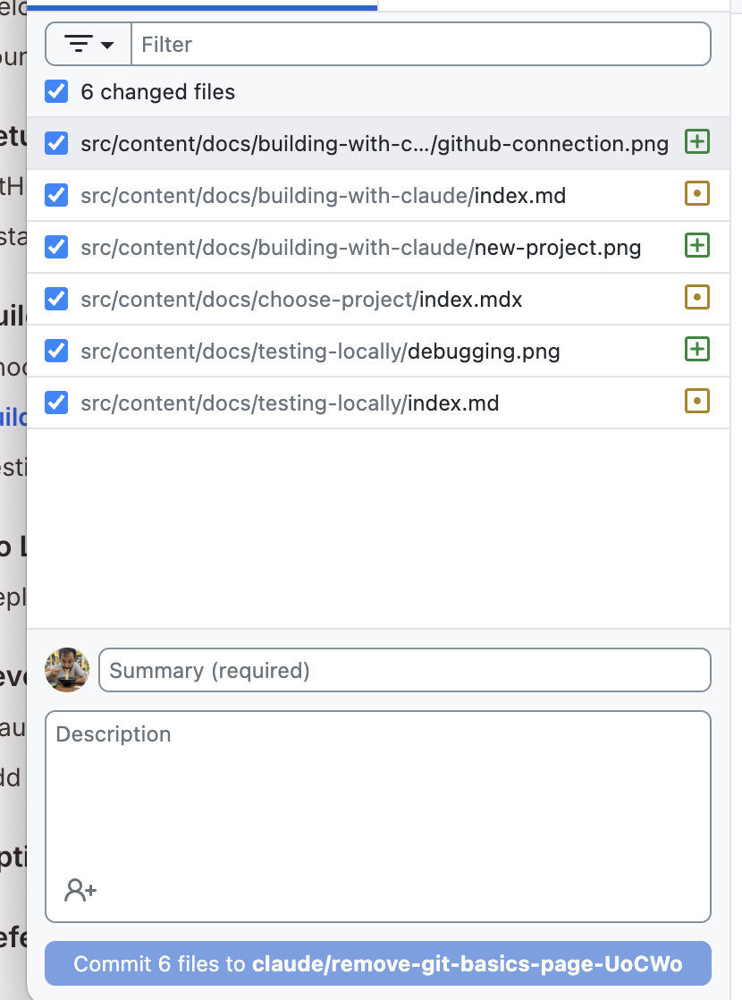

Now that Claude Code has created your project, you'll want to make changes and improvements. Here's how!

## Making Changes

Want to tweak something? You have two options:

## Method 1: Ask Claude Code (Recommended)

The easiest way - just tell Claude Code what to change or share some screenshots or design images (only PNG, GIF, WebP, JPEG images are supported, no PDFs)

```text
Change the heading font to something more playful
```

```text
Make the buttons bigger and add rounded corners
```

```text
Add a footer with copyright information
```

## Method 2: Edit Files Yourself

You can also edit files directly using any text editor:

1. Open the file in a text editor (VS Code, Notepad++, TextEdit, etc.)
2. Make your changes
3. Save the file
4. Refresh your browser to see the changes

<div class="tip-box">
  <strong>💡 Pro Tip:</strong> Try making small changes yourself! If you break something, you can always ask Claude Code to fix it.
</div>

### Save Your Progress with GitHub Desktop

After making changes to your project, let's save them with GitHub Desktop:

#### Step 1: Open GitHub Desktop

1. Switch to GitHub Desktop. 
2. Click on '**Fetch Origin**' incase you want to fetch the changes Claude Code has made and verify locally.
3. If you have made any changes manually in the editor, you should see your new files listed in the "Changes" tab.

<div class="tip-box">
  Incase you asked Claude to make the changes for you, you can skip Step 2 and 3 that are written below.
</div>

#### Step 2: Review Your Changes

Click on the files to see what was created or modified. All the changed files should be checked.



#### Step 3: Commit Your Changes

1. In the "Summary" field at the bottom left, type something that describes the changes you made
   - First time: `Initial project created with Claude Code`
   - After changes: `Updated button styles and added footer`
1. Click the **"Commit to branch"** button

## Best Practices

### 1. Commit Often
Save your work frequently with meaningful commit messages. This creates a history you can refer back to.

### 2. Test Before Committing
Always view your changes in the browser before committing to make sure they work as expected.

### 3. Write Clear Commit Messages
Instead of "updates" or "changes", write:
- "Add contact form with validation"
- "Fix navigation menu alignment"
- "Update color scheme to blue"

You can even ask Claude to help you write these.

<div class="checkpoint">
  <div class="checkpoint-title">✅ Checkpoint</div>
  <p>You know how to make changes and save your progress. Ready to test your project!</p>
</div>

## Next Steps

In the next section, we'll learn how to view your project in a browser and make sure everything works correctly.
