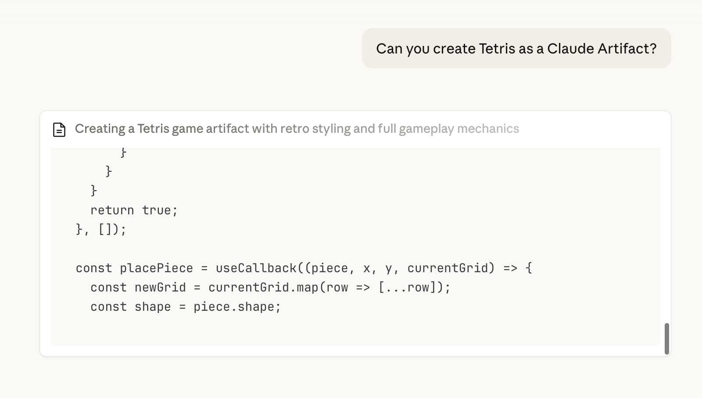

Before we dive into installations and setups, let's experience what AI can do **right now**.

ChatGPT, Grok and Claude are the popular LLMs in the western world. For this exercise, we will be using Claude though you could try this with the LLM of your choice.

## What is Claude?

Think of Claude as a **super-smart assistant** that you can talk to via a chat interface in plain English. Today you can use Claude and other LLMs to do a variety of tasks from editing blog posts to generating images and even building full-fledged apps.

Claude has a feature called **Artifacts** that lets you create things instantly in your browser - no setup required!

### Step 1: Open Claude

Go to [claude.ai](https://claude.ai/) in your browser and create an account.  

### Step 2: Ask Claude to Create Something

Once you login, you should be able to see an interface with an input field. Try asking Claude some simple queries to familiarise yourself.

Once you are ready, let's head to making your first AI assisted artifact. 

Copy and paste this prompt into Claude:

```
Can you create Tetris as a Claude Artifact?
```

Press **Enter** and watch!

Note: feel free to use any other simple game you would want to create or check out these additional [Prompts](#additional-prompts).

### Step 3: See the Magic

Within seconds, Claude will create a **working Tetris game** right in your browser!



### Step 4: Iterate on the outcome

Was the outcome to your satisfaction?
If not, try asking it to make changes.

E.g., You can ask it to change the visual style or add some fun new game elements.

✅ You just created your first app with AI!
All within 5 minutes. Imagine what you can build with more time.

## Additional Prompts

Here are some fun things to ask Claude to create:

### A Pomodoro Timer

```
Create a Pomodoro timer with 25-minute work sessions and 5-minute breaks.
Add start, pause, and reset buttons. Show the time in a large, easy-to-read format.
```

### A Color Palette Generator

```
Create a color palette generator that shows 5 harmonious colors.
Add a "Generate New Palette" button. Show the hex codes for each color and let me click to copy them.
```

### A Simple Game

```
Create a simple memory card matching game with 8 pairs of cards. When I click two cards, show if they match. Track my number of moves.
```

## Why This Matters

What you just did is the core of what we'll learn in this workshop:

1. **You gave AI instructions** (a prompt)
2. **AI created something useful** (code that works)
3. **You used it immediately** (no complex setup)

The difference? **Claude Artifacts** run in your browser temporarily. In this workshop, you'll learn to:

- Create projects that **live permanently** on the internet
- Build things **on your own computer**
- Have **full control** over your code
- Share your creations with **anyone in the world**

## Ready for More?

Now that you've seen what's possible, let's set up the tools that will let you build anything you can imagine.

<div class="tip-box">
  <strong>💡 Keep that Claude tab open!</strong> You can use Artifacts to quickly prototype ideas throughout the workshop.
</div>
