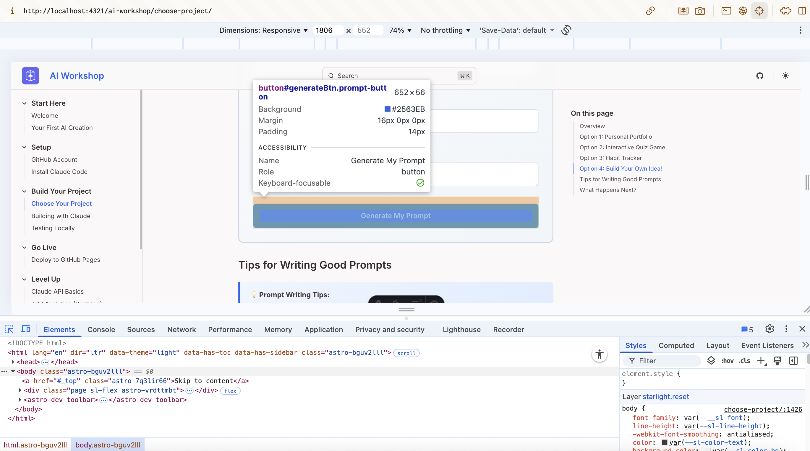

Before sharing your project with the world, let's make sure it works properly on your own computer.

## What Does "Testing Locally" Mean?

"Local" means on your own computer (as opposed to "the cloud" or "online").

When you test locally:
- Only you can see it
- Changes appear instantly
- You can break things safely (no one else will see!)
- It's free - no hosting needed

## Accessing Claude's Changes with Github Desktop


### Step 1: Open GitHub Desktop

Switch to GitHub Desktop. You should see the above bar at the top. The left-most section is the repository you are on. The middle section is the branch you are on and the rightmost section is the 'actionable' section.

### Step 2: Navigate to your branch


Use the branch selector to select the branch that Claude worked on. 

### Pulling from Origin

After you select the correct branch, you may see a button to "Pull Origin". Do that. If not click on '**Fetch Origin**' and wait for the app to check for updates.

## Testing Locally

There are two methods, you can choose between to test Claude Code's work.

## Method 1: Just Open the HTML File

If you choose to build a simple static project, then the simplest way to view your project is to navigate to the folder in your file finder and open the **index.html** file

Opening this file should open a new browser window and you should be able to view your project. 

<div class="tip-box">
  <strong>💡 Tip:</strong> The address bar will show something like <code>file:///path/to/your/file</code>. This means you're viewing a local file, not a website on the internet.
</div>

## Method 2: Use a Local Server (Recommended)

Some features (like loading data or using certain JavaScript) require a "real" server. Here's how to set one up:

### Step 1: Opening Terminal

**Windows:**
1. Press `⊞ Win + R` to open Run dialog
2. Type `cmd` and press Enter
3. The Command Prompt window will open

**Mac:**
1. Press `Cmd + Space` to open Spotlight
2. Type `Terminal` and press Enter
3. The Terminal window will open


<div class="tip-box">
  <strong>💡 Terminal Reference:</strong> For more terminal commands and tips, check out the <a href="/ai-workshop/reference/cheat-sheet/#terminal--command-line">Terminal section of our Cheat Sheet</a>.
</div>

### Step 2: Navigate to Your Project

In the terminal, use `cd` (change directory) to go to your project folder. You can use the system's folder information menu action to find the full folder pathname.

**Windows:**
```bash
cd Documents\GitHub\my-project
```

**Mac:**
```bash
cd ~/Documents/GitHub/my-project
```

<div class="tip-box">
  <strong>💡 Tip:</strong> Replace "my-project" with your actual project folder name. If you're not sure where GitHub Desktop saves projects, check GitHub Desktop → Preferences → Advanced → Repository storage location.
</div>


You can verify you're in the right place by running:
- **Windows:** `dir`
- **Mac:** `ls`

You should see your project files (or an empty folder if you just created it).

### Step 3: Run the server
Now that you have navigated to your project folder in the terminal, run the follwoing command:

**Python 3:**
```bash
python -m http.server 8000
```

**Python 2 (older systems):**
```bash
python -m SimpleHTTPServer 8000
```

This should setup the local server at port 8000 and when it's running, it should open up your browser automatically to the correct url. If it doesn't use the url below.
```
http://localhost:8000
```

If you encounter any error in the terminal window, copy and paste that error into Claude's chat and Claude will be able to tell you what you need to do.

## Testing Checklist

Go through your project and check these things:

### Visual Checks

- [ ] Does everything appear on screen?
- [ ] Do the colors look right?
- [ ] Is text readable (not too small/large)?
- [ ] Do images load correctly?

### Interactive Checks

- [ ] Do buttons do something when clicked?
- [ ] Do links go to the right places?
- [ ] Do forms accept input?
- [ ] Do animations/effects work?

### Responsive Checks (Mobile-Friendly)

Most browsers let you simulate mobile devices:

1. Right-click anywhere on the page
2. Click **"Inspect"** or **"Inspect Element"**
3. Click the **device toggle** icon (looks like a phone/tablet)
4. Select different devices to test

## Found a Problem? Fix It!

When something's not right, you have options:

### Option 1: Ask Claude Code

Go back to Claude Code and describe the issue:

```text
When I click "Submit", nothing happens. The form should
show a success message.
```

Or take a screenshot of the error and describe how you would want to fix it.

```text
The color contrast of the button on the homepage isn't as per accessibility guidelines. Can you fix it?
```

### Option 2: Debug Yourself

Open your browser's developer tools:

- **Windows**: Press `F12` or `Ctrl + Shift + I`
- **Mac**: Press `Cmd + Option + I`

Look for red error messages in the **Console** tab. These tell you what went wrong. If you can't understand what they mean, paste these messages into Claude chat and it will be able to help you take the next steps.



## Troubleshooting

### Images Not Loading

**Possible causes:**
- Wrong file path (check the `src` attribute)
- File is in the wrong folder
- Typo in the filename (case matters!)

**Fix:** Make sure your image path matches exactly where the file is:
```html
<!-- If image is in the same folder -->


<!-- If image is in an "images" folder -->

```

### CSS Not Applying

**Possible causes:**
- CSS file not linked in HTML
- Typo in the CSS link path
- Browser cached old version

**Fix:** Check your HTML `<head>` section:
```html
<link rel="stylesheet" href="styles.css">
```

Try hard refresh: `Ctrl + Shift + R` (Windows) or `Cmd + Shift + R` (Mac)

### JavaScript Not Working

**Possible causes:**
- Script file not linked
- Script loaded before HTML elements exist
- Syntax error in code

**Fix:** Check Console for errors, and make sure your script is at the bottom of the body:
```html
<body>
  <!-- Your content -->

  <script src="script.js"></script>  <!-- Put scripts at the end! -->
</body>
```


<div class="checkpoint">
  <div class="checkpoint-title">✅ Checkpoint</div>
  <p>Your project works locally and you've saved your progress. Are there any changes you would like to make?</p>
</div>

## Next Steps

Now that you've got the first version of your vibe coded project running. You can proceed to make changes or head to deploy it on Github.
